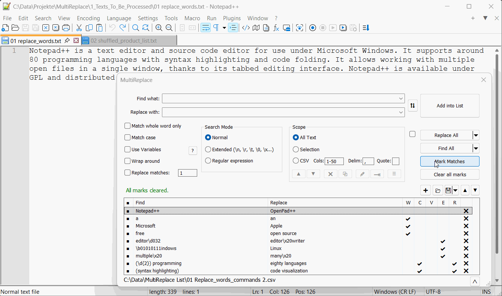

# MultiReplace for Notepad++

MultiReplace is a Notepad++ plugin that allows users to create, store, and manage search and replace strings within a list, proving useful across various sessions or projects. This enhancement increases efficiency when multiple replacements need to be made concurrently, thereby bolstering the overall functionality of Notepad++.

## Key Features

-   **Multiple Replacements**: Execute multiple replacements in a single operation.
-   **Entry Toggling**: Toggle list entries for replacement, highlighting, or searching.
-   **String Storage**: Store and load your search and replace strings in a list, facilitating reuse across different sessions or projects.
-   **CSV Scope Functionality**: Target specific columns in a delimited file for search or replacement operations, offering precision in managing CSV data.
-   **Scripted Text Replacements**: Export to bash script for scripted text replacements.
-   **Highlighting**: Highlight multiple find words in unique colors for better visual distinction.
-   **Variable Usage**: Employ variables for conditional and computational operations within the replacement string.

## Scope Functions
Scope functions define the range for searching and replacing strings:
-   **Selection Option**: Supports Rectangular and Multiselect to focus on specific areas for search or replace.
-   **CSV Option**: Enables targeted search or replacement within specified columns of a delimited file.
    -   `Cols`: Specify the columns for focused operations.
    -   `Delim`: Define the delimiter character.
    -   `Quote`: Delineate areas where characters are not recognized as delimiters.

## Option 'Use Variables'
Activate the '**Use Variables**' checkbox to employ variables associated with specified strings, allowing for conditional and computational operations within the replacement string. This Dynamic Substitution is compatible with all search settings of Search Mode, Scope, and the other options.

Note: Utilize either the `set()` or `cond()` command in 'Replace with:' to channel the output as the replacement string. Only one of these commands should be used at a time.

### Variables Overview
| Variable | Description |
|----------|-------------|
| **CNT**  | Count of the detected string. |
| **LINE** | Line number where the string is found. |
| **APOS** | Absolute character position in the document. |
| **LPOS** | Relative line position. |
| **LCNT** | Count of the detected string within the line. |
| **COL**  | Column number where the string was found (CSV-Scope option selected).|
| **MATCH**| Contains the text of the detected string, in contrast to `CAP` variables which correspond to capture groups in regex patterns. |
| **CAP1**, **CAP2**, ...  | Correspond to capture groups $1, $2, ... in regex patterns. They can be used for calculations or as strings.|
| |Note: For `MATCH` and `CAP` variables, both dot and comma can be used as decimal separators when they contain numerical values, but thousands separators are not supported. |

### Command Overview
#### String Composition
`..` is employed for concatenation.  
E.g., `"Detected "..CNT.." times."`

#### set(strOrCalc)
Outputs strings or numbers directly.

| Example                              | Result (assuming LINE = 5, CNT = 3) |
|--------------------------------------|-------------------------------------|
| `set("replaceString"..CNT)`          | "replaceString3"                    |
| `set(LINE+5)`                        | "10"                                |

#### **cond(condition, trueVal, \[falseVal\])**
Implements if-then-else logic, or if-then if falseVal is omitted.

| Example                                                      | Result (assuming LINE = 5)            |
|--------------------------------------------------------------|---------------------------------------|
| `cond(LINE<=5 or LINE>=9, "edge", "center")`                 | "edge"                                |
| `cond(LINE<3, "Modify this line")`                         | (Original text remains unchanged)     |
| `cond(LINE<10, cond(LINE<5, cond(LINE>2, "3-4", "0-2"), "5-9"), "10+")` | "5-9" (Nested condition) |

#### **fmtN(num, maxDecimals, fixedDecimals)**
Formats numbers based on precision (maxDecimals) and whether the number of decimals is fixed (fixedDecimals being true or false).

**Note**: The `fmtN` command can exclusively be used within the `set` and `cond` commands.
| Example                             | Result  |
|-------------------------------------|---------|
| `set(fmtN(5.73652, 2, true))`       | "5.74"  |
| `set(fmtN(5.0, 2, true))`           | "5.00"  |
| `set(fmtN(5.73652, 4, false))`      | "5.7365"|
| `set(fmtN(5.0, 4, false))`          | "5"     |

### Operators 
| Type        | Operators                     |
|-------------|-------------------------------|
| Arithmetic  | `+`, `-`, `*`, `/`, `^`, `%`  |
| Relational  | `==`, `~=`, `<`, `>`, `<=`, `>=`|
| Logical     | `and`, `or`, `not`            |

### More Examples

| Find in:            | Replace with:                                                                 | Description/Expected Output                                                                                     | Regex | Scope CSV |
|---------------------|-------------------------------------------------------------------------------|----------------------------------------------------------------------------------------------------------------|-------|-----------|
| `;`                 | `cond(LCNT==5,";Column5;")`                                                    | Adds a 5th Column for each line into a `;` delimited file.                                                    | No    | No        |
| `key`                 | `set("key"..CNT)` | Enumerates key values by appending the count of detected strings. E.g., key1, key2, key3, etc. | No | No |
| `(\d+)`               | `set("$1€ The VAT is: ".. (CAP1 * 0.15).."€ Total with VAT: ".. (CAP1 + (CAP1 * 0.15)).."€")` | Finds a number and calculates the VAT at 15%, then displays the original amount, the VAT, and the total amount. E.g., `50` becomes `50€ The VAT is: 7.5€ Total with VAT: 57.5€` | Yes | No |
| `---`               | `cond(COL==1 and LINE<3, "0-2", cond(COL==2 and LINE>2 and LINE<5, "3-4", cond(COL==3 and LINE>=5 and LINE<10, "5-9", cond(COL==4 and LINE>=10, "10+"))))` | Replaces `---` with a specific range based on the `COL` and `LINE` values. E.g., `3-4` in column 2 of lines 3-4, and `5-9` in column 3 of lines 5-9 assuming `---` is found in all lines and columns.| No    | Yes       |
| `(\d+)\.(\d+)\.(\d+)`| `cond(CAP1 > 0 and CAP2 == 0 and CAP3 == 0, MATCH, cond(CAP2 > 0 and CAP3 == 0, " " .. MATCH, " " .. MATCH))` | Alters the spacing based on the hierarchy of the version numbers, aligning lower hierarchies with spaces as needed. E.g., `1.0.0` remains `1.0.0`, `1.2.0` becomes ` 1.2.0`, indicating a second-level version change.| Yes   | No        |
| `(\d+)`             | `set(CAP1 * 2)`                                                               | Doubles the matched number. E.g., `100` becomes `200`.                                                         | Yes   | No        |
| `;`                 | `cond(LCNT == 1, string.rep(" ", 20- (LPOS))..",")`                             | Inserts spaces before the semicolon to align it to the 20th character position if it's the first occurrence.    | No    | No        |
| `-`                   | `cond(LINE == math.floor(10.5 + 6.25 * math.sin((2 * math.pi * LPOS) / 50)), "*", " ")` | Draws a sine wave across a canvas of '-' characters spanning at least 20 lines and 80 characters per line. | No | No |

#### Engine Overview
MultiReplace uses the [Lua engine](https://www.lua.org/), allowing for Lua math operations and string methods. Refer to [Lua String Manipulation](https://www.lua.org/manual/5.1/manual.html#5.4) and [Lua Mathematical Functions](https://www.lua.org/manual/5.1/manual.html#5.6) for more information.

## Technical Features

### String Handling and Visualization
-   Manage search and replace strings in a list.
-   Enable or disable entries for replacement, highlighting or searching within the list.
-   Field limits of 4096 characters for "Find what:" and "Replace with:".
-   Over 20 distinct colors for marking unique words in a Find string.

### Function Toggling
-   "Use List" checkbox toggles operation application between all list entries or the "Find what:" and "Replace with:" fields.

### List Interaction
-   **Add into List Button**: Adds field contents along with their options into the list.
-   **Alt + Up Arrow / Double-Click**: Instantly transfer a row's contents with their options to fields.
-   **Space**: Adjusts selection for individual or multiple highlighted list entries.
-   **Alt-A / Alt-D**: Activates or deactivates all list entries when in focus.
-   **Delete Key / Delete Button (X)**: Select and delete rows.

### Data Import/Export
-   Supports import/export of search and replace strings with their options in CSV format, including selection states.
-   Adherence to RFC 4180 standards for CSV, enabling compatibility and easy interaction with other CSV handling tools.
-   Enables reuse of search and replace operations across sessions and projects.

### Bash Script Export
-   Exports Find and Replace strings into a runnable script, aiming to encapsulate the full functionality of the plugin in the script. However, due to differences in tooling, complete compatibility cannot be guaranteed.
-   This feature intentionally does not support the value `\0` in the Extended Option to avoid escalating environment tooling requirements.
