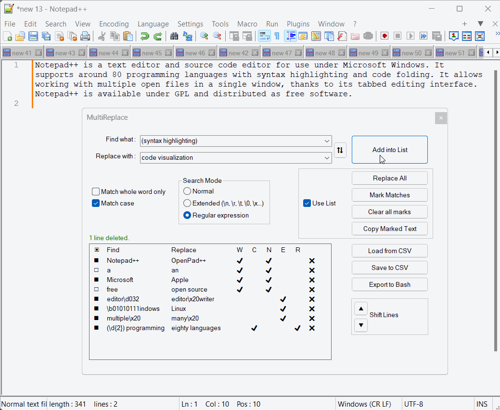

# MultiReplace for Notepad++

MultiReplace is a Notepad++ plugin allowing users to create, store, and manage search and replace strings within a list, useful across various sessions or projects. This enhancement improves efficiency when multiple replacements need to be made concurrently, thereby improving the overall functionality of Notepad++.

The plugin offers the following key features:

- Allows multiple replacements in a single operation.
- Toggles list entries for replacement, highlighting or searching.
- Offers CSV-based string list storage.
- Enables scripted text replacements through bash script export.
- Highlights multiple find words in unique colors for better visual distinction.

MultiReplace is released under the same GNU General Public License as Notepad++ itself.

## Technical Features

### String Handling and Visualization
- Allows the creation and storage of search and replace strings in a list.
- Allows enabling or disabling entries for replacement, highlighting or searching.
- Sets field limits of 4096 characters for "Find what:" and "Replace with:".
- Utilizes the djb2 hash algorithm to ensure consistent color marking of unique words of a Findstring.
- Supports over 20 distinct colors for marking.

### List Interaction
- **Add into List Button**: Adds field contents along with their options into the list.
- **Alt + Up Arrow / Double-Click**: Instantly transfer a row's contents with their options to fields.
- **Space**: Adjusts selection for individual or multiple highlighted list entries.
- **Alt-A / Alt-D**: Activates or deactivates all list entries when in focus.
- **Delete Key / Delete Button (X)**: Select and delete rows.

### Data Import/Export
- Supports import/export of search and replace strings with their options in CSV format, including selection states.
- Adherence to RFC 4180 standards for CSV, enabling compatibility and easy interaction with other CSV handling tools.
- Enables reuse of search and replace operations across sessions and projects.

### Bash Script Export
- Exports Find and Replace strings into a runnable script, aiming to encapsulate the full functionality of the plugin in the script. However, due to differences in tooling, complete compatibility cannot be guaranteed.
- This feature intentionally does not support the value `\0` in the Extended Option to avoid escalating environment tooling requirements.

### Function Toggling
- "Use List" checkbox toggles operation application between all list entries or the "Find what:" and "Replace with:" fields.

### Compatibility
- Full compatibility with standard Notepad++ search parameters, including "Match whole word only", "Match case", and "Search Mode".
