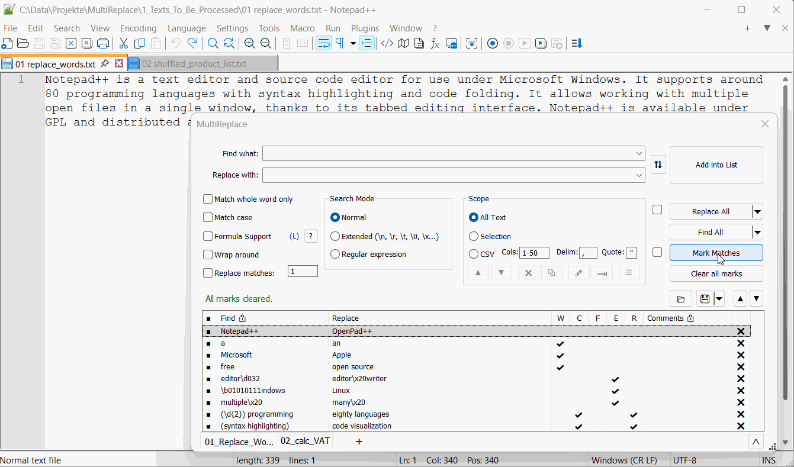

# MultiReplace for Notepad++

MultiReplace is a Notepad++ plugin designed for complex and repeatable text transformations. Its foundation is the management of search/replace operations in reusable lists, suitable for use across sessions and projects.

For data-heavy tasks, the plugin provides dedicated tools. These include specific operations on CSV columns (e.g., sort, delete) and the use of external files as lookup tables.

At its core, an optional **Formula Support** mode lets any replacement be enhanced with conditional (if/then) and mathematical logic, providing the flexibility needed for specific and complex requirements.

## Table of Contents
- [Key Features](#key-features)
- [Search Configuration](#search-configuration)
  - [Search Mode](#search-mode)
  - [Match Options](#match-options)
  - [Filling the Find Field from Selection](#filling-the-find-field-from-selection)
- [Search Scopes and Targets](#search-scopes-and-targets)
  - [Search Scopes](#search-scopes)
  - [CSV Scope and Column Operations](#csv-scope-and-column-operations)
  - [Execution Targets](#execution-targets)
- [Search Results Window](#search-results-window)
- [Engine Overview](#engine-overview)
  - [Lua](#lua)
  - [ExprTk](#exprtk)
- [Option 'Formula Support'](#option-formula-support)
  - [Full Syntax Reference (Lua, ExprTk) →](FORMULA-SUPPORT.md)
- [User Interaction and List Management](#user-interaction-and-list-management)
  - [Entry Interaction and Limits](#entry-interaction-and-limits)
  - [Context Menu and Keyboard Shortcuts](#context-menu-and-keyboard-shortcuts)
  - [List Columns](#list-columns)
  - [List Toggling](#list-toggling)
  - [Column Locking](#column-locking)
  - [List Saving and Loading](#list-saving-and-loading)
- [Plugin Menu](#plugin-menu)
- [Settings and Customization](#settings-and-customization)
  - [1. Search and Replace](#1-search-and-replace)
  - [2. List View and Layout](#2-list-view-and-layout)
  - [3. CSV Options](#3-csv-options)
  - [4. Copy Report](#4-copy-report)
  - [5. Appearance](#5-appearance)
  - [INI-Only Settings](#ini-only-settings)
- [Multilingual UI Support](#multilingual-ui-support)

## Key Features

- **Batch Replacement Lists** — Run any number of search-and-replace pairs in a single pass, either in the current document, across filtered open documents, or in entire directory trees.
- **CSV Column Toolkit** — Search, replace, sort, or delete specific columns; with numeric-aware sorting and header exclusion across all operations.
- **Reusable Replacement Lists** — Save, load, and drag-and-drop lists with all options intact—perfect for recurring workflows.
- **External Lookup Tables** — Swap matches with values from external hash/lookup files—ideal for large or frequently updated mapping tables.
- **Smart Replacements** — Turn on **Formula Support** to calculate or change matches with variables and conditions, powered by ExprTk or Lua.
- **Precision Scopes & Selections** — Rectangle and multi-selection support, column scopes, and "replace at specific match" for pinpoint operations.
- **Multi-Color Highlighting** — Highlight search hits in up to 28 distinct colors for rapid visual confirmation.
- **Search Results Window** — A dockable panel lists every hit; double-click a result to jump straight to it, with folding and color-coding.

 

## Search Configuration
This section describes the different modes and options to control how search patterns are interpreted and matched.

### Search Mode
The search mode determines how the text in the **Find what** field is interpreted.

- **Normal** — Treats the search string literally. Special characters like `.` or `*` have no special meaning.

- **Extended** — Allows the use of backslash escape sequences to find or insert special and non-printable characters.

  | Sequence | Description            | Example                                                             |
  |----------|------------------------|---------------------------------------------------------------------|
  | `\n`     | Line Feed (LF)         | Replaces all `\n` with a space to join lines.                       |
  | `\r`     | Carriage Return (CR)   | Useful for cleaning up Windows-style line endings (`\r\n`).         |
  | `\t`     | Tab character          | Replaces four spaces with `\t`.                                     |
  | `\0`     | NULL character         | Finds or inserts the NULL character.                                |
  | `\\`     | Literal Backslash      | To search for a single `\`, you must enter `\\`.                    |
  | `\xHH`   | Hexadecimal value      | `\x41` finds or inserts the character **A**.                        |
  | `\oNNN`  | Octal value            | `\o101` finds or inserts **A**.                                     |
  | `\dNNN`  | Decimal value          | `\d065` finds or inserts **A**.                                     |
  | `\bNNNNNNNN` | Binary value       | `\b01000001` finds or inserts **A**.                                |
  | `\uXXXX` | Unicode character      | `\u20AC` finds or inserts **€**. *(Plugin extension, not in standard Notepad++.)* |

- **Regular expression** — Enables powerful pattern matching using the regex engine integrated into the Notepad++ editor component. It supports common syntax for character classes (`[a-z]`), quantifiers (`*`, `+`, `?`), and capture groups (`(...)`). For a detailed reference, see the official Notepad++ Regular Expressions documentation.

### Match Options
These options refine the search behavior across all modes.

- **Match Whole Word Only** — The search term is matched only if it is a whole word, surrounded by non-word characters.
- **Match Case** — Makes the search case-sensitive, treating `Hello` and `hello` as distinct terms.
- **Formula Support** — Allows the use of variables within the replacement string for dynamic and conditional replacements. See the [chapter 'Formula Support'](#option-formula-support) for details.
- **Wrap Around** — If active, the search continues from the beginning of the document after reaching the end.
- **Replace matches** — Applies to all **Replace All** actions (current document, open documents, and in files). Allows you to specify exactly which occurrences of a match to replace. Accepts single numbers, commas, or ranges (e.g., `1,3,5-7`).
- **Bookmark matched lines** — A small checkbox to the left of the **Mark Matches** button. When ticked, every match line additionally receives a Notepad++ bookmark, so the matches can be navigated with F2 / Shift+F2.

### Filling the Find Field from Selection
Highlight text in the editor, then bring it into the **Find what** field in one step:

- **Ctrl+Shift+H** — Global hotkey. Copies the current Scintilla selection into the **Find what** field regardless of which window has focus, without opening or focusing MultiReplace.
- **On panel activation** — When the panel becomes visible (opened from the menu, or after being hidden), the current selection is also copied into **Find what**.

Both behaviors require **Fill Find field with selected text on activation** to be enabled in [Settings > Search and Replace](#1-search-and-replace). When **Auto-escape special characters for active search mode** is enabled in the same group, the picked-up text is escaped to match literally in the active mode — useful when picking up code fragments while **Regex** or **Extended** mode is active.

## Search Scopes and Targets
This section describes **where** to search (Scopes) and **in which files** (Targets).

### Search Scopes
Search scopes define the area within a document for search and replace operations.

- **All Text** — The entire document is searched.
- **Selection** — Operations are restricted to the selected text. Supports standard, rectangular (columnar), and multi-selections.

### CSV Scope and Column Operations
Selecting the **CSV** scope enables powerful tools for working with delimited data.

**Scope Definition:**
- **Cols** — Specify the target columns for the operation (e.g., `1,3,5-7`). For sorting, the sequence is crucial as it defines the priority (e.g., `3,1` sorts by column 3, then 1). Descending ranges like `5-3` are also supported.
- **Delim** — Define the delimiter character.
- **Quote** — Specify a quote character (`"` or `'`) to ignore delimiters within quoted text.

**Available Column Operations:**
- **Sorting Lines by Columns** — Sort lines based on one or more columns in ascending or descending order. The sorting algorithm correctly handles mixed numeric and text values, including currency formats like `$100`, `100 EUR`, or `.5`.
  - **Smart Undo (Toggle Sort)** — A second click on the same sort button reverts the lines to their original order. This powerful undo works even if rows have been modified, added, or deleted after the initial sort.
- **Exclude Header Lines** — Header rows are protected from sort, duplicate detection, and find/replace. Configure the number of header rows in [Settings > CSV Options](#3-csv-options). Set to `0` to disable.
- **Deleting Multiple Columns** — Remove specified columns at once, automatically cleaning up obsolete delimiters.
- **Clipboard Column Copying** — Copy the content of specified columns, including their delimiters, to the clipboard.
- **Flow Tabs (Column Alignment)** — Visually aligns columns in tab-delimited and CSV files for easier reading and editing.
  - For CSV files, temporary tabs are inserted to simulate uniform column spacing. For tab-delimited files, existing tabs are realigned.
  - The **Column Alignment** button toggles alignment on or off; pressing it again restores the original spacing.
  - Numeric values are right-aligned by default; this behavior can be turned off in [Settings > CSV Options](#3-csv-options).
- **Duplicate Line Detection** — Identifies and marks duplicate rows based on specified columns.
  - The first occurrence of each group is kept; only subsequent duplicates are marked.
  - After detection, a dialog offers the option to delete duplicates or keep them for inspection.
  - Marks can be cleared using the **Clear Matches** button.
  - Optionally set bookmarks on duplicates for navigation — enable in [Settings > CSV Options](#3-csv-options).

### Execution Targets
Execution targets define **which files** an operation is applied to. They are accessible via the **Replace All** and **Find All** split-button menus.

- **Replace All** / **Find All** — Executes the operation in the **current document only**.
- **Replace All in Open Documents** / **Find All in Open Documents** — Executes the operation across **open documents** in Notepad++. When selected, a filter panel appears for configuration.
  - **All documents** — When checked, all open documents are processed. When unchecked, only documents matching the filter pattern are included.
  - **Filters:** Semicolon-separated list of filename patterns to include or exclude (e.g., `*.cpp; *.h; !test_*`). Supports filenames with spaces.
- **Replace All in Files** / **Find All in Files** — Extends the operation scope to entire directory structures. When selected, a dedicated panel appears for configuration.
  - **Directory:** The starting folder for the file search.
  - **Filters:** Semicolon-separated list of patterns to include or exclude files and folders (e.g., `*.cpp; *.h; !*.bak`).
  - **In Subfolders:** Recursively include all subdirectories.
  - **In Hidden Files:** Include hidden files and folders.
- **Debug Mode** — Runs a simulation of the replacement to inspect variables without modifying the document. See [Debug Mode](FORMULA-SUPPORT.md#debug-mode) for details.

**Filter Syntax**

Patterns are separated by semicolons (`;`). Spaces around semicolons are ignored, and filenames containing spaces are fully supported.

| Prefix   | Example              | Description                                                            |
|----------|----------------------|------------------------------------------------------------------------|
| *(none)* | `*.cpp; *.h`         | Includes files matching the pattern.                                   |
| `!`      | `!*.bak`             | Excludes files matching the pattern.                                   |
| `!\`     | `!\obj\`             | Excludes the specified folder *non-recursive* (Files mode only).       |
| `!+\`    | `!+\logs\`           | Excludes the specified folder **and** all its subfolders *recursive* (Files mode only). |

**Operation Control**

- **Progress Feedback** — A message line shows real-time progress (percentage and current file).
- **Cancel Button** — A **Cancel** button appears during long operations, allowing safe abort.
- **Encoding Handling** — Encoding (ANSI, UTF-8, UTF-16, etc.) is auto-detected and preserved when writing changes back to disk.

 

## Search Results Window

The **Search Results Window** is a dedicated dockable panel that displays all matches from **Find All** operations. It provides a structured, navigable view of search results across one or multiple files.

### Features

- **Hierarchical Display** — Results are organized in a collapsible tree structure: Search Header → File → Criterion → Individual Hits. Each level can be expanded or collapsed for easy navigation.
- **Color-Coded Matches** — When using the replacement list, each search term is highlighted in its own distinct color (up to 28 colors). This visual distinction makes it easy to identify which list entry produced each match.
- **Double-Click Navigation** — Double-click any result line to open the file and jump to the exact match position.
- **Navigate via Matches Column** — After a Find All, double-click the **Matches** count of any list entry to jump to its next match in the editor. Navigation starts from the current cursor position in the Search Results Window and wraps to the first match at the end.
- **Context Menu** — Right-click to access options like Copy Lines, Copy Paths, Open Selected Files, Fold/Unfold All, and Clear Results.
- **Persistent Results** — By default, new searches append to existing results, allowing you to accumulate findings. Enable "Purge on new search" in the context menu to clear previous results automatically.
- **Word Wrap** — Toggle word wrap via the context menu for long lines.

### Keyboard Shortcuts

The following keyboard shortcuts are available when the Search Results Window has focus:

| Key       | Action                                                                 |
|-----------|------------------------------------------------------------------------|
| Enter     | Navigate to the selected match in the editor, or toggle fold on a header line. |
| Space     | Toggle fold on a header line.                                          |
| Escape    | Close the Search Results Window.                                       |
| Delete    | Remove the selected result line(s).                                    |

Additionally, three navigation commands are available from the **Plugins > MultiReplace** menu and can be assigned to custom keyboard shortcuts via **Settings > Shortcut Mapper > Plugin Commands**:

| Command                  | Description                                                            |
|--------------------------|------------------------------------------------------------------------|
| Focus Search Results     | Show the Search Results Window and set keyboard focus to it.           |
| Next Search Result       | Jump to the next match in the editor and highlight it in the results.  |
| Previous Search Result   | Jump to the previous match in the editor and highlight it in the results. |

The color-coding of search results can be configured in [Settings > Appearance](#5-appearance) via the **Use list colors in search results** option.

 

## Engine Overview

When **Formula Support** is enabled, replacements run through a formula engine. MultiReplace ships with two: **Lua** and **ExprTk**. Switch via the `(L)` / `(E)` indicator next to the **Formula Support** checkbox. The choice is per tab and persists across sessions.

**Quick guidance:** for most everyday jobs — doing math on a captured number, numbering matches, formatting a date or duration, a quick conditional — **ExprTk** is the easiest start: a single short formula, with captures available as numbers (`num(N)`) or text (`txt(N)`) without any conversion step. Choose **Lua** when the task grows into real programming: loops, multi-step logic, lookup tables, or loading external files. Both read and write UTF-8 and both handle everyday string work, so for simple tasks either one is fine — but if you're unsure, start with ExprTk and switch to Lua only when you actually need its extra power.

|              | Lua                                                          | ExprTk                                                       |
|--------------|-------------------------------------------------------------|--------------------------------------------------------------|
| Best for     | Logic-heavy text work: branching, lookups, loops, external files | Number crunching and tidy one-line formulas; dates and durations |
| Style        | A small script — multiple statements, variables, control flow | One expression per replacement, kept short                 |
| Captures     | `CAP1`, `CAP2`, … (text; `tonum()` for math)                | `txt(N)` for text, `num(N)` for math — no conversion step    |
| Strings      | Full standard string library                                 | Everyday toolkit: `slice`, `split`, `trim`, `find`, `replace`, join with `+` |
| Math         | The basics, build up the rest in code                        | Large built-in set out of the box (trig, stats, rounding, min/max/avg over many values) |
| Dates        | `os.date` / `os.time`, full locale handling                  | `d:` output format + `todate()` for reading dates back in    |
| Formatting   | `string.format` (printf-style)                               | Inline `~` spec: width, padding, sign, hex/binary, durations, date layout |
| Logic & loops| Everything: `if/else`, `while`, `for`, `repeat`              | `if`-style conditionals inside the expression; no loops      |
| External files | Load data lookups and variables from files, plus reusable function libraries (`lkp`, `lvars`, `lcmd`) | Load reusable function libraries from `.elib` files (`loadlib`) |
| Speed        | Fast enough for anything                                     | Very fast for pure number work                               |

### Lua

Powered by the [Lua programming language](https://www.lua.org/). See [Lua String Manipulation](https://www.lua.org/manual/5.4/manual.html#6.4) and [Lua Mathematical Functions](https://www.lua.org/manual/5.4/manual.html#6.6) for the standard library reference. The MultiReplace-specific commands (`set`, `cond`, `vars`, `lkp`, ...) are documented in the [Lua Reference](FORMULA-SUPPORT.md#lua-reference).

### ExprTk

Powered by [ExprTk](https://www.partow.net/programming/exprtk/index.html) by Arash Partow ([source on GitHub](https://github.com/ArashPartow/exprtk)) — a header-only C++ mathematical expression library. The MultiReplace integration syntax is documented in the [ExprTk Reference](FORMULA-SUPPORT.md#exprtk-reference). The `(?=...)` formula marker and the approach of exposing capture groups and match state as formula variables are adapted from Coises' [Columns++](https://coises.github.io/ColumnsPlusPlus/).

 

## Option 'Formula Support'

The **Formula Support** option enables dynamic replacements that go beyond plain text substitution. Instead of a fixed replacement string, you write a small expression that is evaluated for each match — accessing the matched text, capture groups, counters, line and file information, and producing a computed result.

For example, doubling every captured number:

| Find    | Replace                  | Engine  |
|---------|--------------------------|---------|
| `(\d+)` | `set(tonum(CAP1) * 2)`   | Lua     |
| `(\d+)` | `(?=num(1) * 2)`         | ExprTk  |

Switch the engine via the `(L)` / `(E)` indicator next to the option — see [Engine Overview](#engine-overview) above for the differences between the two.

### Full Syntax Reference

The complete reference for both engines lives in **[FORMULA-SUPPORT.md](FORMULA-SUPPORT.md)**:

- **[Lua Reference](FORMULA-SUPPORT.md#lua-reference)** — Quick Start, all commands (`set`, `cond`, `vars`, `lkp`, `lcmd` ...), operators, if-then logic, examples
- **[ExprTk Reference](FORMULA-SUPPORT.md#exprtk-reference)** — Quick Start, pattern syntax, math built-ins, control flow, string output, examples

 

## User Interaction and List Management
Manage search and replace strings within the list using the context menu, which provides comprehensive functionalities accessible by right-clicking on an entry, using direct keyboard shortcuts, or mouse interactions.

### Entry Interaction and Limits
- **Manage Entries** — Manage search and replace strings in a list, and enable or disable entries for replacement, highlighting, or searching within the list.
- **Highlighting** — Highlight multiple find words in unique colors for better visual distinction, with up to 28 distinct colors available.
- **Character Limit** — Find and replace texts have no fixed length limit. Very long texts may slow down processing.

### Context Menu and Keyboard Shortcuts
Right-click on any entry in the list or use the corresponding keyboard shortcuts to access these options:

| Menu Item                | Shortcut      | Description                                                 |
|--------------------------|---------------|-------------------------------------------------------------|
| Undo                     | Ctrl+Z        | Reverts the last change made to the list, including sorting and moving rows. |
| Redo                     | Ctrl+Y        | Reapplies the last action that was undone, restoring previous changes. |
| Transfer to Input Fields | Alt+Up        | Transfers the selected entry to the input fields for editing. |
| Update from Input Fields | Alt+Down      | Updates the selected entries with the current content of the input fields. |
| Search in List           | Ctrl+F        | Initiates a search within the list entries. Inputs are entered in the "Find what" and "Replace with" fields. |
| Cut                      | Ctrl+X        | Cuts the selected entry to the clipboard.                   |
| Copy                     | Ctrl+C        | Copies the selected entry to the clipboard.                 |
| Paste                    | Ctrl+V        | Pastes content from the clipboard into the list.            |
| Edit Field               |               | Opens the selected list entry for direct editing.           |
| Delete                   | Del           | Removes the selected entry from the list.                   |
| Select All               | Ctrl+A        | Selects all entries in the list.                            |
| Enable                   | Alt+E         | Enables the selected entries, making them active for operations. |
| Disable                  | Alt+D         | Disables the selected entries to prevent them from being included in operations. |

**Note on 'Edit Field':** The edit field supports multiple lines, simplifying the management of complex 'Formula Support' statements.

**Additional Interactions:**

| Interaction                | Shortcut             | Description                                                 |
|----------------------------|----------------------|-------------------------------------------------------------|
| Toggle entry activation    | Space                | Toggles the activation state of the selected entries.       |
| In-place editing           | Double-Click         | Opens the selected entry for direct in-place editing (configurable in Settings). |
| Move rows up / down        | Ctrl+Up / Ctrl+Down  | Moves selected rows up or down in the list. Hold for auto-repeat. |
| Toggle list visibility     | Ctrl+L               | Collapses or expands the list.                              |
| Fill Find field with selection | Ctrl+Shift+H     | Copies the current Scintilla selection into the **Find what** field. Works as a global hotkey regardless of which window has focus, without opening or focusing MultiReplace. |
| List/input mode bypass     | Ctrl+Shift + Button Click | Momentarily flips the list-vs-input mode for the clicked action. With an active list, the action uses the input fields (list dims); with a dimmed list (when **Keep list always visible** is enabled), the action uses the list. Release the keys to return. |

### List Columns
- **Find** — The text or pattern to search for.
- **Replace** — The text or pattern to replace with.
- **Options Columns:**
  - **W** — Match whole word only.
  - **C** — Match case.
  - **F** — Formula Support.
  - **E** — Extended search mode.
  - **R** — Regular expression mode.
- **Additional Columns:**
  - **Matches** — Shows the hit count for each entry. Double-click to navigate through matches (see [Search Results Window](#search-results-window)).
  - **Replaced** — Shows the number of replacements made for each 'Replace with' string.
  - **Comments** — Add custom comments to entries for annotations or additional context.
  - **Modified** — Shows a persistent timestamp (YYYY-MM-DD HH:MM:SS) recording when each entry was last changed. Updated automatically on content changes, saved in list files.
  - **Delete** — Contains a delete button for each entry, allowing quick removal from the list.

- **Dirty-Flag Indicator** — A subtle stripe appears at the left edge of rows that have been modified since the last save or load, providing a quick visual cue for unsaved changes.

You can manage the visibility of the additional columns via the **Header Column Menu** by right-clicking on the header row. Columns can also be **reordered by dragging** their headers. Use **Reset Column Order** from the header right-click menu to restore the default layout.

### List Toggling
The **"Use List"** button toggles between processing the entire list or just the single "Find what" / "Replace with" fields. You can also press **Ctrl+L** from anywhere in the panel to toggle the list.

- **Classic behavior (default)** — Toggling the list off collapses it to save screen space.
- **Keep list always visible** — When this option is enabled in the Settings (List View and Layout), the list stays visible even while it is inactive. Instead of collapsing, inactive entries are visually dimmed so the list remains usable as a reference while you work with the single input fields.
- **Ctrl+Shift bypass** — Hold **Ctrl+Shift** while clicking an action button (Find Next, Replace, Replace All, etc.) to momentarily flip the current list-vs-input mode: an active list is bypassed in favor of the input fields (and dims visually); a dimmed list (only possible with **Keep list always visible** enabled) is temporarily activated. Release the keys to return. Useful for quick one-off operations without toggling permanently.

### Column Locking

You can lock specific column widths to prevent them from resizing automatically when the window layout changes. This is particularly useful for keeping key columns like **Find**, **Replace**, or **Comments** visible at a fixed size.

- **How to Lock** — Double-click the column divider line in the list header.
- **Visual Feedback** — A lock icon (🔒) appears in the header of the locked column.
- **Effect** — Locked columns maintain their exact pixel width, while unlocked columns adjust dynamically to fill the remaining space.

### List Saving and Loading
- **Save List / Load List** — Store and reload your search/replace entries. The Save dialog offers three formats: **MultiReplace List (*.mrl)** — the full-fidelity internal format with the settings preamble; **CSV (*.csv)** — the same escaped body without the preamble; and **CSV (Excel) (*.csv)** — plain CSV for interchange with spreadsheets and other tools. Older `.csv` list files from earlier plugin versions remain loadable without conversion.
- **Copy & Paste** — Entries move in and out as text via the list's context menu or Ctrl+C/Ctrl+V. The clipboard uses the escaped dialect and accepts the same column-named input described under **Format**, so lists can also be generated externally and pasted straight in.
- **Drag & Drop** — You can load lists by dragging `.mrl` or `.csv` files onto the plugin window.
- **Tabs** — Keep multiple lists open side by side. Click **+** to add a tab, double-click to rename, drag to reorder, right-click for options (save as, load, duplicate, close). Dropping a list file on the tab bar opens it in its own tab. Tabs and their contents persist across sessions.
- **Format** — Plain-text, line-based. The list body is a CSV-style table of entries; an `.mrl` file additionally starts with a `[MultiReplace-Settings]...[End]` preamble storing per-list options (search mode, scope, CSV column/delimiter/quote settings). MultiReplace supports two body dialects:
  - **Escaped (internal)** — used by `.mrl` and the plain `.csv` save. Fields are quoted and special characters are escaped: `\` → `\\`, newline → `\n`, carriage return → `\r`, `"` → `""`. This keeps every entry on one physical line even when a field contains a real newline (e.g. a multi-line regex). It is the default and the format the clipboard copy/paste uses.
  - **Plain / "CSV (Excel)"** — standard RFC 4180 CSV. No backslash escaping (a `\` stays literal), fields are quoted only when they contain the delimiter, a quote, or a newline, embedded quotes are doubled (`""`), and real newlines are allowed inside quoted fields. This is what spreadsheets read and write, so you can build or edit lists in Excel (or any tool) and load them straight back. The field delimiter defaults to the Windows list separator (comma in most locales, semicolon in others such as German) and can be overridden with `[List] PlainCsvDelimiter` (`,` or `;`) in the INI; on load the delimiter is auto-detected from the header.
  - **Columns & header** — Both file loading and clipboard paste accept input whose first row is a column-name header. Known names: `Find`, `Replace`, `Selected`, `WholeWord`, `MatchCase`, `FormulaSupport`, `Extended`, `Regex`, `Comments` (case-insensitive; spaces, underscores, hyphens ignored). Columns can be in any order, unknown columns are ignored, and only `Find` is required — missing optional columns default to off / empty. The smallest valid input is two lines: `Find` followed by a search pattern.
  
  The two dialects cannot be told apart from content alone (a backslash is an escape in one and a literal in the other), so the format is chosen by the dialog filter, not guessed. The escaped formats are the default; the plain "CSV (Excel)" format is a portable export that does not write the settings preamble. Workspace preferences (column widths, visibility, order) stay local to each user's INI and are not written into the file, so lists remain portable across machines and users. The preamble is read content-based, not by extension: the loader reads it when the first line is `[MultiReplace-Settings]` and otherwise treats the whole file as a CSV body, so a `.csv` carrying a preamble still loads its settings and a `.mrl` without one loads as a plain body.

## Plugin Menu

The plugin registers a few entries under **Plugins → MultiReplace** in the Notepad++ menu bar. Most are one-click actions; the entries marked as toggles show a checkmark when active.

- **MultiReplace...** — Opens or focuses the MultiReplace panel.
- **Settings...** — Opens the **Settings Panel** (see [Settings and Customization](#settings-and-customization)).
- **Documentation** — Opens this README in the browser.
- **Tandem Mode** *(toggle)* — Attaches the MultiReplace window to the *outside* of a Notepad++ window edge and keeps it there on every move or resize. The last used edge is remembered, and the enabled state survives Notepad++ restarts.
- **Reopen on Startup** *(toggle)* — When enabled, MultiReplace automatically reopens on the next Notepad++ launch if it was open at the previous shutdown. Opt-in by design, so the plugin only appears when you want it to.
- **About** — Shows version and credits.

## Settings and Customization

You can customize the behavior and appearance of MultiReplace via the dedicated **Settings Panel**. To open it, click the **Settings** entry in the plugin menu or the context menu.

### 1. Search and Replace
Control the behavior of search operations and cursor movement.

- **Replace: Don't move to the following occurrence** — If checked, the cursor remains on the current match after clicking "Replace". If unchecked, it automatically jumps to the next match (standard behavior).
- **Find: Search from cursor position** — If checked,  "Find All", "Replace All", and "Mark" start from the current cursor position. If unchecked, operations always process the entire defined scope.
- **Mute all sounds** — Disables the notification sound (beep) when a search yields no results. The window will still flash visually to indicate "not found".
- **File Search: Skip files larger than** — Defines a maximum size (in MB) for **Find/Replace in Files**. Skips larger files to ensure responsiveness and prevent high memory usage.

**Find input from selection** — Controls how the editor selection is brought into the **Find what** field. See [Filling the Find Field from Selection](#filling-the-find-field-from-selection) for the full workflow.

- **Fill Find field with selected text on activation** — When enabled, the current Scintilla selection is copied into the **Find what** field when MultiReplace becomes visible, and whenever the **Ctrl+Shift+H** hotkey is pressed (regardless of focus).
- **Auto-escape special characters for active search mode** — When enabled, the picked-up text is automatically escaped to match the active search mode literally. In **Regex** mode, metacharacters like `(`, `)`, `.`, `+`, `?` are prefixed with `\`, tabs become `\t`, and any line ending (CR, LF, or CRLF) becomes `\R` (matches any newline sequence). In **Extended** mode, line breaks and tabs are converted to `\n`, `\r`, `\t`. In **Normal** mode no transformation is applied.

### 2. List View and Layout
Manage the visual elements and behavior of the replacement list to save screen space or increase information density.

- **Visible Columns:**
  - **Matches** — Toggles the column displaying the number of hits for each entry.
  - **Replaced** — Toggles the column displaying the number of replacements made.
  - **Comments** — Toggles the user comment column.
  - **Modified** — Toggles the timestamp column showing when each entry was last changed.
  - **Delete Button** — Toggles the column containing the 'X' button for deleting rows.
- **List Results:**
  - **Show list statistics** — Displays a summary line below the list (Active entries, Total items, Selected items).
  - **Find All: Group hits by list entry** — When On, search results in the docking window are grouped hierarchically by the list entry that found them. When Off, results are displayed as a flat list sorted by position.
- **List Interaction & View:**
  - **Highlight current match in list** — Automatically highlights the list row corresponding to the current find/replace operation.
  - **Edit in-place on double-click** — When On, double-clicking a cell allows editing the text directly. When Off, double-clicking transfers the entry content to the top input fields.
  - **Show full text on hover** — Displays a tooltip with the complete text for long entries that are truncated in the view.
  - **Expanded edit height (lines)** — Defines how many lines the in-place edit box expands to when modifying multiline text (Range: 2–20).
  - **Keep list always visible** — When enabled, toggling the list off no longer collapses it. The list stays visible and is dimmed instead, so you can keep using it as a reference while working with the single input fields. See [List Toggling](#list-toggling) for details.

### 3. CSV Options
Settings specific to the CSV column manipulation and alignment features.

- **Flow Tabs: Right-align numeric columns** — When using the **Flow Tabs** feature (Column Alignment), numeric values will be right-aligned within their columns for better readability. Text remains left-aligned.
- **Flow Tabs: Don't show intro message** — Suppresses the informational dialog that appears when activating Flow Tabs for the first time.
- **CSV: Header lines to exclude** — Number of header rows protected from sort, duplicate detection, and find/replace. Set to `0` to disable.
- **Mark duplicate rows with bookmarks** — Places Notepad++ bookmarks on duplicate lines for navigation (F2 / Shift+F2). Clears existing bookmarks when active.

### 4. Copy Report
Copies a report of the whole list to the clipboard via **Copy Report** from the context menu. The report always covers the entire list (selection is ignored) and is meant for spreadsheets; to copy entries back into MultiReplace use **Copy** instead.

- **Template** — Defines the output format using placeholders. Available placeholders:
  - `%FIND%` — Find pattern
  - `%REPLACE%` — Replace text
  - `%COMMENT%` — Comment
  - `%FCOUNT%` — Find count
  - `%RCOUNT%` — Replace count
  - `%MODIFIED%` — Last modified timestamp
  - `%ROW%` — Row number
  - `%SEL%` — Enabled state (1/0)
  - `%REGEX%`, `%CASE%`, `%WORD%`, `%EXT%`, `%VAR%` — Option flags (1/0)
  - Use `\t` for tab delimiter (e.g., `%FIND%\t%REPLACE%\t%COMMENT%` for TSV format).
- **Include header row** — Adds a header line with column names before the data rows. Enabled by default.

Fields are always quoted in Excel-compatible CSV style (embedded `"` doubled, real newlines kept inside the quoted field), so the report pastes straight into a spreadsheet. This is a one-way report for spreadsheets; to copy entries back into MultiReplace use the context-menu **Copy** instead.

### 5. Appearance
Customize the look and feel of the plugin window.

- **Interface:**
  - **Foreground transparency** — Sets the window opacity when the plugin is active/focused.
  - **Background transparency** — Sets the window opacity when the plugin loses focus.
  - **Scale factor** — Scales the entire plugin UI (buttons, text, list size). Useful for high-DPI monitors or accessibility preferences (Range: 50% to 200%).
- **Display Options:**
  - **Enable tooltips** — Toggles the helper popups that appear when hovering over buttons and options.
  - **Use list colors in search results** — When checked, search hits in the result docking window are color-coded matching the specific color assigned to their list entry. When unchecked, all search results use a uniform standard color.
  - **Use list colors for text marking** — When checked, highlights matches in the editor using the specific color defined in the list entry. When unchecked, all marked text uses a single standard highlight color.

### INI-Only Settings

Some advanced options are not exposed in the UI and can only be configured by editing `MultiReplace.ini` directly:

| Section | Key | Default | Description |
|---------|-----|---------|-------------|
| `[Lua]` | `SafeMode` | `0` | When set to `1`, disables Lua libraries that access the file system (`os`, `io`, `package`, `dofile`, etc.) for security. When `0`, full Lua functionality is enabled (required for `lvars`, `lkp`, and `lcmd`). |
| `[Options]` | `DimIntensity` | `50` | Controls how strongly the list is dimmed when inactive (with **Keep list always visible** enabled or during a Ctrl+Shift bypass). Range: `0` (no dimming, list looks identical whether active or not) to `100` (text fully blended into background). Changes take effect after restarting Notepad++. |
| `[Options]` | `TabMaxLength` | `15` | Maximum number of characters shown in tab labels before truncation with an ellipsis (…). Increase for longer logical names, decrease for a more compact tab bar. The full name remains visible in the tab tooltip regardless of this setting. Range: `4` to `60`. Changes take effect after restarting Notepad++. |

## Multilingual UI Support

MultiReplace supports multiple languages. The plugin automatically detects the language selected in Notepad++ and applies the corresponding translation if available.

You can customize the translations by editing the `languages.ini` file located in:
`C:\Program Files\Notepad++\plugins\MultiReplace\` (or your specific installation path).

Contributions to the `languages.ini` file on [GitHub](https://github.com/daddel80/notepadpp-multireplace/blob/main/languages.ini) are welcome!